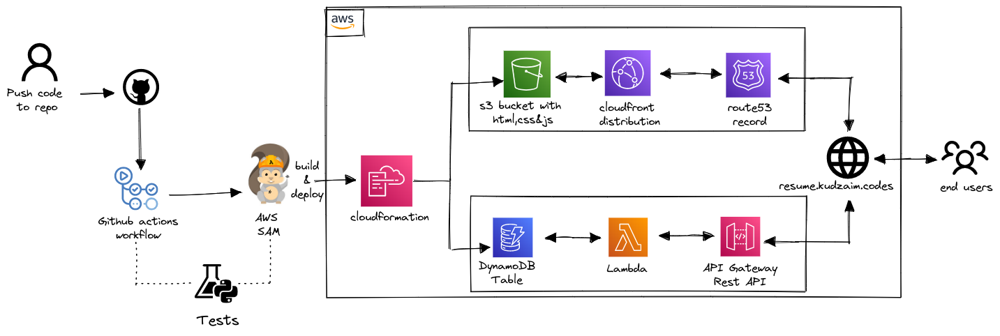

<br />
<div align="center">
  <h3 align="center">Cloud Resume Frontend</h3>
  <p align="center">
A serverless resume website with view counter using AWS. Built to participate in <a href="https://twitter.com/forrestbrazeal" target="_blank" >Forrest Brazeal's</a>.
    <br />
    <a href="https://cloudresumechallenge.dev/docs/the-challenge/aws/"><strong>See the challenge »</strong></a>
    <br />
    <br />
    <a href="https://resume.kudzaim.codes">View Demo</a>
    |
    <a href="https://github.com/kmabika/crc-backend">View Backend Repo</a>
    |
    <a href="https://kudzaimabika.hashnode.dev/cloud-resume-challenge-on-aws-my-journal" target="_blank">Read Blog</a>
  </p>
</div>

<!-- ABOUT THE PROJECT -->
## About
This challenge involves the development of a website that will serve as a display for my resume, with a site view counter. The challenge requires the website to be hosted on Amazon S3, the site be served via CloudFront, to update the visit counter API Gateway, AWS Lambda, DynamoDB will be used. Additionally, this all must be automated using the AWS Serverless Application Model (SAM) and a CI/CD pipeline. 
<br><br/>

### Architecture

This  project uses following AWS services:

<figcaption align = "center"><b>Logical diagram of architecture</b></figcaption>
<br><br/>
I completed the challenge by breaking the project into two tasks the frontend and backend.
<br></br>

- Frontend
<br>

1. I started by developing my website in HTML, CSS & JavaScript. Next, I uploaded my website into an S3 bucket and setup static website hosting.

2. I created a cloudfront distribution and setup my S3 bucket as the origin. 

3. I created a Route53 public hosted zone and added a record for my subdomain. Linking my subdomain hosted by another domain to Route53 was a little bit challenging but I figured it out and I got a certificate from AWS Certificate Manager and domain setup was complete.

4. Lastly, I built a CI/CD pipeline to sync my S3 bucket and invalidate my cloudfront cache. My pipeline uses GitHub actions to update my S3 bucket for push updates to my repo on the main branch.

- Backend
<br>
  Firstly I setup AWS SAM for local development to experiment with DynamoDB, Lambda, API Gateway without incuring costs. Read the backend repo <a href="https://github.com/kmabika/crc-backend/blob/main/README.md">README.md</a> to develop Serverless applications locally.
 

1. Firstly I created the AWS SAM template with all the required resources.
2. I wrote some python code for the Lambda function which is invoked each time the API is called. The Lambda function's handler updates the count and retrieves the count from the DynamoDB table. The update function makes use of DynamoDB's atomic counter feature to update the count each time the API endpoint gets called.

3. The Lambda function and the API endpoints are exposed publicly via an API gateway. Its a simple API gateway deployed as part of the SAM template. All of the Lambda function routes are routed via the API gateway. This gets inherently created with the SAM deployment and I have not customized the one which gets created.

4. Lastly, I built a CI/CD pipeline backend of my site. My sam-pipeline uses GitHub actions and workflow to test the lambda code and deploy the SAM Application to an S3 bucket and CloudFormation creates the resources.


### Setup & Usage

1. Clone Repo
   ```git
   git clone https://github.com/kmabika/crc-frontend
   ```

<!-- ROADMAP -->
## Roadmap

- [x] Develop HTML CSS JavaScript
- [x] Deploy Resume on Amazon S3 as static website
- [x] Setup Cloudfront distribution and custom domain name with Route 53
- [x] CI/CD Github actions to upload source code to S3